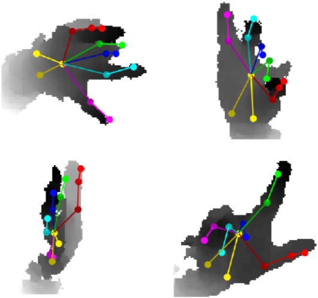
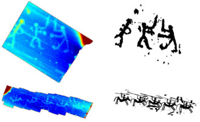
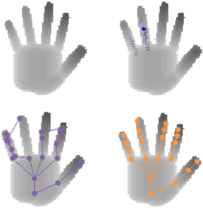
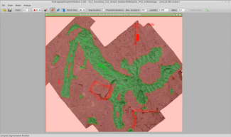
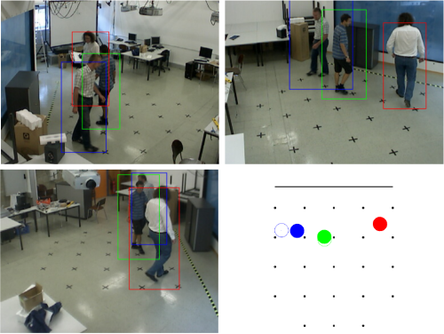
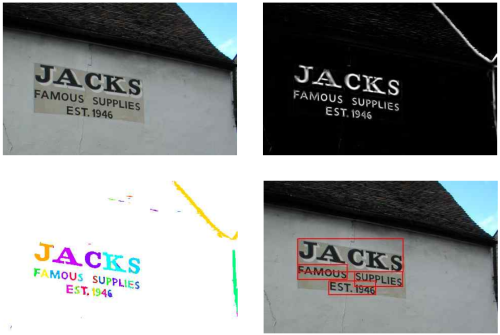

---
# You don't need to edit this file, it's empty on purpose.
# Edit theme's home layout instead if you wanna make some changes
# See: https://jekyllrb.com/docs/themes/#overriding-theme-defaults
layout: home
---
Link to  [my official university page](https://www.tugraz.at/institute/icg/research/team-bischof/lrs/people/poier/).

I'm a research assistant and PhD student at the [Institute for 
Computer Graphics and Vision](https://www.tugraz.at/institute/icg/home/) 
at [Graz University of Technology](https://www.tugraz.at/home/),
where I'm working with 
[Prof. Horst Bischof](https://www.tugraz.at/institute/icg/research/team-bischof/people/team-about/horst-bischof/).

Links to papers and additional material can be found below
(as this site should be more "durable" and easier 
to handle than my official university page).
For information about other projects and open student projects see 
[my official university page](https://www.tugraz.at/institute/icg/research/team-bischof/lrs/people/poier/).

---

## Publications

<table class="paperlisttable">
    <tr>
      <td class="paperfigurecol"></td>
      <td>
        <b>MURAUER: Mapping Unlabeled Real Data for Label AUstERity</b> 
        Georg Poier, Michael Opitz, David Schinagl and Horst Bischof 
        In <i>Proc. WACV</i>, 2019. 
		<a href="https://arxiv.org/abs/1811.09497">[Paper (arXiv)]</a>&nbsp;&nbsp;&nbsp;&nbsp;&nbsp;
		<a href="https://poier.github.io/murauer/">[Project]</a>
      </td>
    </tr>
    <tr>
      <td></td>
      <td>
        <b>Learning Pose Specific Representations by Predicting Different Views</b> 
        Georg Poier, David Schinagl and Horst Bischof 
        In <i>Proc. CVPR</i>, 2018. (selected for <b>spotlight</b> presentation) 
		<a href="https://arxiv.org/abs/1804.03390">[Paper (arXiv)]</a>&nbsp;&nbsp;&nbsp;&nbsp;&nbsp;
		<a href="https://poier.github.io/PreView/">[Project]</a>
      </td>
    </tr>
    <tr>
      <td></td>
      <td>
        <b>Being lazy at labelling for pose estimation</b> 
        Georg Poier, David Schinagl and Horst Bischof 
        In <i>Proc. AAPR</i>, 2018. (featured presentation) 
		<a href="https://workshops.aapr.at/wp-content/uploads/Proceedings/2018/OAGM_2018_paper_27.pdf">[Paper]</a>
      </td>
    </tr>
    <tr>
      <td></td>
      <td>
        <b>The 3D-Pitoti Dataset: A Dataset for high-resolution 3D Surface Segmentation</b> 
        Georg Poier, Markus Seidl, Matthias Zeppelzauer, Christian Reinbacher, 
		Martin Schaich, Giovanna Bellandi, Alberto Marretta and Horst Bischof 
        In <i>Proc. CBMI</i>, 2017. (selected for <b>oral</b> presentation) 
		<a href="http://dx.doi.org/10.1145/3095713.3095719">[Paper (ACM DL)]</a>&nbsp;&nbsp;&nbsp;&nbsp;&nbsp;
		<a href="https://files.icg.tugraz.at/f/130d433de1/">[More detailed Tech. Report (pdf)]</a>&nbsp;&nbsp;&nbsp;&nbsp;&nbsp;
		<a href="https://files.icg.tugraz.at/f/affa3d1b2d/">[Slides]</a>&nbsp;&nbsp;&nbsp;&nbsp;&nbsp;
		<a href="https://www.tugraz.at/institute/icg/research/team-bischof/lrs/downloads/3dpitotidataset/">[Project]</a>
      </td>
    </tr>
    <tr>
      <td><!------></td>
      <td>
        <b>Loss-Specific Training of Random Forests for Super-Resolution</b> 
        Alexander Grabner, Georg Poier, Michael Opitz, Samuel Schulter and Peter M. Roth 
        In <i>Proc. CVWW</i>, 2017. (selected for <b>oral</b> presentation) 
		<a href="https://www.tugraz.at/fileadmin/user_upload/Institute/ICG/Images/team_lepetit/publications/grabner_cvww17.pdf">[Paper (pdf)]</a>
      </td>
    </tr>
    <tr>
      <td><!------></td>
      <td>
        <b>Grid Loss: Detecting Occluded Faces</b> 
        Michael Opitz, Georg Waltner, Georg Poier, Horst Possegger and Horst Bischof 
        In <i>Proc. ECCV</i>, 2016. 
		<a href="https://arxiv.org/abs/1609.00129">[Paper (arXiv)]</a>
      </td>
    </tr>
    <tr>
      <td></td>
      <td>
        <b>The 3D-PITOTI Project with a Focus on Multi-Scale 3D Reconstruction using Semi-Autonomous UAVs</b> 
        Christian Mostegel, Georg Poier, Christian Reinbacher, Manuel Hofer, 
		Friedrich Fraundorfer, Horst Bischof, Thomas Höll, Gert Holler and Axel Pinz 
        In <i>Proc. OAGM-ARW Joint Workshop</i>, 2016.
      </td>
    </tr>
    <tr>
      <td></td>
      <td>
        <b>Interactive 3D Segmentation of Rock-Art by Enhanced Depth Maps and Gradient Preserving Regularization</b> 
        Matthias Zeppelzauer, Georg Poier, Markus Seidl, Christian Reinbacher, 
		Samuel Schulter, Christian Breiteneder and Horst Bischof 
        <i>ACM Journal on Computing and Cultural Heritage</i>, 9(4):19:1-19:30, 2016. 
		<a href="http://dx.doi.org/10.1145/2950062">[Paper (ACM DL)]</a>&nbsp;&nbsp;&nbsp;&nbsp;&nbsp;
		<a href="https://www.tugraz.at/institute/icg/research/team-bischof/lrs/downloads/3dpitotidataset/">[Project]</a>
      </td>
    </tr>
    <tr>
      <td></td>
      <td>
        <b>Hybrid One-Shot 3D Hand Pose Estimation by Exploiting Uncertainties</b> 
        Georg Poier, Konstantinos Roditakis, Samuel Schulter, Damien Michel, 
		Horst Bischof and Antonis A. Argyros 
        In <i>Proc. BMVC</i>, 2015. (selected for <b>oral</b> presentation) 
		<a href="https://arxiv.org/abs/1510.08039">[Paper (arXiv)]</a>&nbsp;&nbsp;&nbsp;&nbsp;&nbsp;
		<a href="https://files.icg.tugraz.at/f/94fb10b530/">[Ext. Abstract]</a>&nbsp;&nbsp;&nbsp;&nbsp;&nbsp;
		<a href="https://files.icg.tugraz.at/f/f83335969c/">[Slides]</a>&nbsp;&nbsp;&nbsp;&nbsp;&nbsp;
		<a href="https://www.tugraz.at/institute/icg/research/team-bischof/lrs/downloads/hybridhpe/">[Project]</a>
      </td>
    </tr>
    <tr>
      <td></td>
      <td>
        <b>Interactive Segmentation of Rock-Art in High-Resolution 3D Reconstructions</b> 
        Matthias Zeppelzauer, Georg Poier, Markus Seidl, Christian Reinbacher, Christian Breiteneder, Horst Bischof and Samuel Schulter 
        In <i>Proc. Digital Heritage</i>, 2015. (selected for <b>oral</b> presentation; <b>Best Paper Award</b>) 
		<a href="https://files.icg.tugraz.at/f/36cdbe7ae6f248918d9a/">[Paper]</a>&nbsp;&nbsp;&nbsp;&nbsp;&nbsp;
		<a href="https://www.tugraz.at/institute/icg/research/team-bischof/lrs/downloads/3dpitotidataset/">[Project]</a>&nbsp;&nbsp;&nbsp;&nbsp;&nbsp;
		<a href="https://vimeo.com/154729160">[Video (vimeo)]</a>
      </td>
    </tr>
    <tr>
      <td></td>
      <td>
        <b>Navigation Assistance and Guidance of Older Adults across Complex Public Spaces: the DALi Approach</b> 
        Luigi Palopoli, Antonis A. Argyros, Josef A. Birchbauer, Alessio Colombo, 
		Daniele Fontanelli, Axel Legay, Andrea Garulli, Antonello Giannitrapani, 
		David Macii, Federico Moro, Payam Nazemzadeh, Pashalis Padeleris, 
		Roberto Passerone, Georg Poier, Domenico Prattichizzo, Tizar Rizano, 
		Luca Rizzon, Stefano Scheggi and Sean Sedwards 
        <i>Intelligent Service Robotics</i> 8(2):77-92, 2015. 
		<a href="http://disi.unitn.it/~palopoli/publications/isr2015.pdf">[Paper (pdf)]</a>&nbsp;&nbsp;&nbsp;&nbsp;&nbsp;
		<a href="https://www.youtube.com/watch?v=jr3Wrsvn944">[Video (YouTube)]</a>
      </td>
    </tr>
    <tr>
      <td></td>
      <td>
        <b>Hough Forests Revisited: An Approach to Multiple Instance Tracking from Multiple Cameras</b> 
        Georg Poier, Samuel Schulter, Sabine Sternig, Peter M. Roth and Horst Bischof 
        In <i>Proc. GCPR</i>, 2014. 
		<a href="http://citeseerx.ist.psu.edu/viewdoc/download?doi=10.1.1.644.9738&rep=rep1&type=pdf">[Paper (pdf)]</a>
      </td>
    </tr>
    <tr>
      <td></td>
      <td>
        <b>Text Localization in Unconstrained Images</b> 
        Georg Poier, Jürgen Hatzl, Stefan Kluckner, Peter M. Roth and Horst Bischof 
        In <i>Proc. CVWW</i>, 2012. 
		<a href="https://www.tugraz.at/fileadmin/user_upload/Institute/ICG/Documents/lrs/pubs/poier_cvww_12.pdf">[Paper (pdf)]</a>
      </td>
    </tr>
    <tr>
      <td></td>
      <td>
        <b>AVSS 2011 Demo Session: OUTLIER – Online Learning and Visualization of Unusual Events</b> 
        Josef A. Birchbauer, Samuel Schulter, René Schuster, Georg Poier, 
		Martin Winter, Peter Schallauer, Peter M. Roth and Horst Bischof 
        In <i>Proc. AVSS</i>, 2011. 
		<a href="https://www.computer.org/csdl/proceedings/avss/2011/0844/00/06027403.pdf">[Ext. Abstract (pdf)]</a>
      </td>
    </tr>
    <tr>
      <td></td>
      <td>
        <b>Multi-Cue Learning and Visualization of Unusual Events</b> 
        René Schuster, Samuel Schulter, Georg Poier, Martin Hirzer, Josef A. Birchbauer, 
		Peter M. Roth, Horst Bischof, Martin Winter and Peter Schallauer 
        In <i>Proc. ICCV Workshops</i>, 2011. 
		<a href="https://ieeexplore.ieee.org/stamp/stamp.jsp?arnumber=6130485">[Paper (pdf)]</a>
      </td>
    </tr>
  </table>

<!---
**MURAUER: Mapping Unlabeled Real Data for Label AUstERity**  
Georg Poier, Michael Opitz, David Schinagl and Horst Bischof  
In *Proc. WACV*, 2019.  
[[Paper (arXiv)]](https://arxiv.org/abs/1811.09497) &nbsp;&nbsp;&nbsp;&nbsp;&nbsp;
[[Project page]](https://poier.github.io/murauer/)

**Learning Pose Specific Representations by Predicting Different Views**  
Georg Poier, David Schinagl and Horst Bischof  
In *Proc. CVPR*, 2018. (selected for **spotlight** presentation)   
[[Paper (arXiv)]](https://arxiv.org/abs/1804.03390) &nbsp;&nbsp;&nbsp;&nbsp;&nbsp;
[[Project page]](https://poier.github.io/PreView/)

**Being lazy at labelling for pose estimation**  
Georg Poier, David Schinagl and Horst Bischof  
In *Proc. AAPR*, 2018. (featured presentation)   
[[Paper]](https://workshops.aapr.at/wp-content/uploads/Proceedings/2018/OAGM_2018_paper_27.pdf)

**The 3D-Pitoti Dataset: A Dataset for high-resolution 3D Surface Segmentation**  
Georg Poier, Markus Seidl, Matthias Zeppelzauer, Christian Reinbacher, Martin Schaich, Giovanna Bellandi, Alberto Marretta and Horst Bischof  
In *Proc. CBMI*, 2017. (selected for **oral** presentation)  
[[Paper (ACM)]](http://dx.doi.org/10.1145/3095713.3095719) &nbsp;&nbsp;&nbsp;&nbsp;&nbsp;
[[More detailed Technical Report (pdf)]](https://files.icg.tugraz.at/f/130d433de1/) &nbsp;&nbsp;&nbsp;&nbsp;&nbsp;
[[Project Page]](https://www.tugraz.at/institute/icg/research/team-bischof/lrs/downloads/3dpitotidataset/)

**Loss-Specific Training of Random Forests for Super-Resolution**  
Alexander Grabner, Georg Poier, Michael Opitz, Samuel Schulter and Peter M. Roth  
In *Proc. CVWW*, 2017. (selected for **oral** presentation)  
[[Paper (pdf)]](https://www.tugraz.at/fileadmin/user_upload/Institute/ICG/Images/team_lepetit/publications/grabner_cvww17.pdf)

**Grid Loss: Detecting Occluded Faces**  
Michael Opitz, Georg Waltner, Georg Poier, Horst Possegger and Horst Bischof  
In *Proc. ECCV*, 2016.  
[[Paper (arXiv)]](https://arxiv.org/abs/1609.00129)

**The 3D-PITOTI Project with a Focus on Multi-Scale 3D Reconstruction using Semi-Autonomous UAVs**  
Christian Mostegel, Georg Poier, Christian Reinbacher, Manuel Hofer, Friedrich Fraundorfer, Horst Bischof, Thomas Höll, Gert Holler and Axel Pinz  
In *OAGM-ARW Joint Workshop*, 2016.

**Interactive 3D Segmentation of Rock-Art by Enhanced Depth Maps and Gradient Preserving Regularization**  
Matthias Zeppelzauer, Georg Poier, Markus Seidl, Christian Reinbacher, Samuel Schulter, Christian Breiteneder and Horst Bischof  
*ACM Journal on Computing and Cultural Heritage* 9(4):19:1-19:30, 2016.  
[[Paper (ACM)]](http://dx.doi.org/10.1145/2950062) &nbsp;&nbsp;&nbsp;&nbsp;&nbsp;
[[Data]](https://www.tugraz.at/institute/icg/research/team-bischof/lrs/downloads/3dpitotidataset/)

**Hybrid One-Shot 3D Hand Pose Estimation by Exploiting Uncertainties**  
Georg Poier, Konstantinos Roditakis, Samuel Schulter, Damien Michel, Horst Bischof and Antonis A. Argyros.  
In *Proc. BMVC*, 2015. (selected for **oral** presentation)  
[[Paper (arXiv)]](https://arxiv.org/abs/1510.08039) &nbsp;&nbsp;&nbsp;&nbsp;&nbsp;
[[Extended Abstract (pdf)]](https://files.icg.tugraz.at/f/94fb10b530/) &nbsp;&nbsp;&nbsp;&nbsp;&nbsp;
[[Slides]](https://files.icg.tugraz.at/f/f83335969c/) &nbsp;&nbsp;&nbsp;&nbsp;&nbsp;
[[Project Page]](https://www.tugraz.at/institute/icg/research/team-bischof/lrs/downloads/hybridhpe/)

**Interactive Segmentation of Rock-Art in High-Resolution 3D Reconstructions**  
Matthias Zeppelzauer, Georg Poier, Markus Seidl, Christian Reinbacher, Christian Breiteneder, Horst Bischof and Samuel Schulter  
In *Proc. Digital Heritage*, 2015. (selected for **oral** presentation; **Best Paper Award**)  
[[Paper (pdf)]](https://files.icg.tugraz.at/seafhttp/files/497262db-83e6-4c4e-9863-02e8b5dc782c/zeppelzauer_dh15.pdf) &nbsp;&nbsp;&nbsp;&nbsp;&nbsp;
[[Data]](https://www.tugraz.at/institute/icg/research/team-bischof/lrs/downloads/3dpitotidataset/) &nbsp;&nbsp;&nbsp;&nbsp;&nbsp;
[[Video (vimeo)]](https://vimeo.com/154729160)

**Navigation Assistance and Guidance of Older Adults across Complex Public Spaces: the DALi Approach**  
Luigi Palopoli, Antonis A. Argyros, Josef A. Birchbauer, Alessio Colombo, Daniele Fontanelli, Axel Legay, Andrea Garulli, Antonello Giannitrapani, David Macii, Federico Moro, Payam Nazemzadeh, Pashalis Padeleris, Roberto Passerone, Georg Poier, Domenico Prattichizzo, Tizar Rizano, Luca Rizzon, Stefano Scheggi and Sean Sedwards  
*Intelligent Service Robotics* 8(2):77-92, 2015.  
[[Paper (pdf)]](http://disi.unitn.it/~palopoli/publications/isr2015.pdf) &nbsp;&nbsp;&nbsp;&nbsp;&nbsp;
[[Video (YouTube)]](https://www.youtube.com/watch?v=jr3Wrsvn944)

**Hough Forests Revisited: An Approach to Multiple Instance Tracking from Multiple Cameras**  
Georg Poier, Samuel Schulter, Sabine Sternig, Peter M. Roth and Horst Bischof  
In *Proc. GCPR*, 2014.  
[[Paper (pdf)]](http://citeseerx.ist.psu.edu/viewdoc/download?doi=10.1.1.644.9738&rep=rep1&type=pdf)

**Text Localization in Unconstrained Images**  
Georg Poier, Jürgen Hatzl, Stefan Kluckner, Peter M. Roth and Horst Bischof  
In *Proc. CVWW*, 2012.  
[[Paper (pdf)]](https://www.tugraz.at/fileadmin/user_upload/Institute/ICG/Documents/lrs/pubs/poier_cvww_12.pdf)

**AVSS 2011 Demo Session: OUTLIER – Online Learning and Visualization of Unusual Events**  
Josef A. Birchbauer, Samuel Schulter, René Schuster, Georg Poier, Martin Winter, Peter Schallauer, Peter M. Roth and Horst Bischof  
In *Proc. AVSS*, 2011.  
[[Extended Abstract (pdf)]](https://www.computer.org/csdl/proceedings/avss/2011/0844/00/06027403.pdf)

**Multi-Cue Learning and Visualization of Unusual Events**  
René Schuster, Samuel Schulter, Georg Poier, Martin Hirzer, Josef A. Birchbauer, Peter M. Roth, Horst Bischof, Martin Winter and Peter Schallauer  
In *Proc. ICCV Workshops*, 2011.
--->

